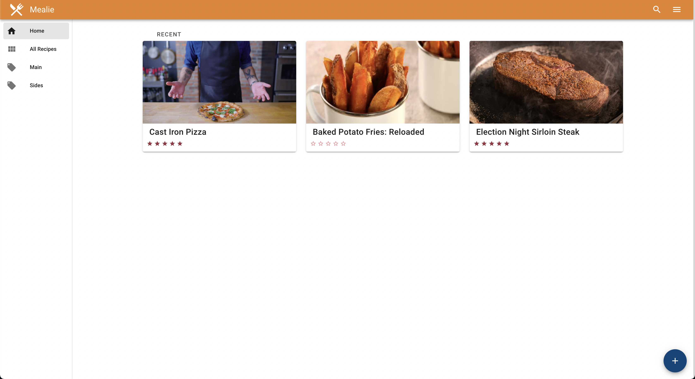

---
# When Publish is set to true the article will be processed
publish: false
title: "My Article Title"
summary: "My Whatever Whateverv"
tags: ['tag1', 'tag2']
# Urls will be downloaded and inserted into the static folder
image: "./image.png"
---

"Testing 123

